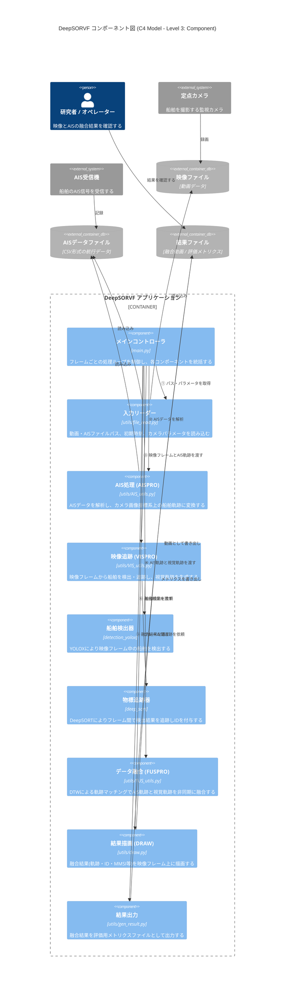

# <p align=center> [TITS 2023] DeepSORVF: 深層学習に基づくシンプルなオンライン・リアルタイム船舶データ融合手法</p>

<div align="center">

[](https://ieeexplore.ieee.org/abstract/document/10159572)
[](https://gy65896.github.io/projects/TITS2023_DeepSORVF/index.html)
[](https://github.com/gy65896/FVessel)
[](https://www.python.org/)
[](https://pytorch.org/)
<a target="_blank" href="https://colab.research.google.com/github/gy65896/DeepSORVF/blob/main/main_example.ipynb">

</a>
<!--[](https://hits.seeyoufarm.com)-->
</div>

---
>**内陸水路における船舶交通監視のための非同期軌跡マッチングに基づくマルチモーダル海事データ融合**<br>
>[Yu Guo](https://scholar.google.com/citations?user=klYz-acAAAAJ&hl=zh-CN), [Ryan Wen Liu](http://mipc.whut.edu.cn/index.html)<sup>* </sup>, [Jingxiang Qu](https://scholar.google.com/citations?user=9zK-zGoAAAAJ&hl=zh-CN), [Yuxu Lu](https://scholar.google.com/citations?user=XXge2_0AAAAJ&hl=zh-CN), Fenghua Zhu<sup>* </sup>, Yisheng Lv <br>
>(* Corresponding Author)<br> 
>IEEE Transactions on Intelligent Transportation Systems

> **概要:** *本研究では、まずAISベースおよび映像ベースの船舶軌跡を抽出し、次にAISベースの船舶情報と対応する視覚的な物標を融合させるための深層学習を用いた非同期軌跡マッチング手法(DeepSORVFと命名)を提案する。さらに、AISベースと映像ベースの運動特徴を組み合わせることで、遮蔽(オクルージョン)条件下でも正確かつロバストな船舶追跡結果を得るための事前知識駆動型の遮蔽対策手法も提示する。*
<hr />


## フローチャート


<div align=center><b>提案する深層学習に基づくシンプルなオンライン・リアルタイム船舶データ融合手法のアーキテクチャ。</b></div>


<div align=center><b>映像ベースの船舶軌跡抽出のための遮蔽対策追跡手法のフローチャート。</b></div>

## ディレクトリ構成
```
DeepSORVF/
├── main.py                # AISデータと映像データの融合処理を実行するメインスクリプト
├── main_example.ipynb     # 実行例を示すJupyterノートブック
├── License
├── deep_sort/              # DeepSORTによる物標追跡モジュール
│   ├── configs/
│   │   └── deep_sort.yaml
│   ├── deep_sort/
│   │   ├── deep/             # 外観特徴抽出用CNN(モデル定義・チェックポイント等)
│   │   ├── sort/              # カルマンフィルタ・マッチングなどの追跡コアロジック
│   │   └── deep_sort.py
│   └── utils/                # DeepSORT用の補助ユーティリティ
├── detection_yolox/        # YOLOXベースの船舶検出モジュール
│   ├── nets/                 # ネットワーク定義
│   ├── utils/                 # 学習・推論用ユーティリティ
│   ├── model_data/            # クラス定義・アンカー設定等
│   ├── train.py               # 学習スクリプト
│   ├── predict.py             # 推論スクリプト
│   └── yolo.py
├── utils/                   # AIS処理・データ融合・可視化用ユーティリティ
│   ├── AIS_utils.py           # AISデータ処理
│   ├── FUS_utils.py           # AIS・映像データ融合処理
│   ├── VIS_utils.py           # 可視化処理
│   ├── draw.py / draw_org.py  # 結果描画
│   ├── file_read.py           # データ読み込み
│   └── gen_result.py          # 結果生成
└── README.md                # README(本ファイル)
```

## コンポーネント図 (C4 Model)

C4モデルのコンポーネント図(レベル3)として、DeepSORVFアプリケーション内部の主要コンポーネントとその関係を示す。



## 開発環境セットアップ (Claude Code などAIエージェント向け)

Claude Codeなどのエージェントで本リポジトリのコード編集・コマンド実行を行う場合は、`.devcontainer/` のdevContainerを介して起動すること。ホスト上で直接 `claude` を起動した場合、後述するアクセス制御（サンドボックス）の保証が効かない。

* VS Codeの「Reopen in Container」、または `docker exec -it <container> claude` でコンテナ内から起動する。
* コンテナ内では `.claude/settings.json`（コミット済み・プロジェクト共有設定）により、Bashコマンドがbubblewrap (`bwrap`) ベースのサンドボックスの中で実行される。設定上は到達可能な外部ホストをアローリスト方式（GitHub/npm/PyPI/NuGet等のみ許可、それ以外はデフォルト拒否）に制限し、`~/.ssh`・`~/.aws`・`.env*` 等の秘密情報ファイルへのアクセスを拒否する設計だが、**現時点(Claude Code 2.1.241)ではこのアローリスト/秘密情報保護は実際には機能していないことを直接検証済み**（ファイルシステムの隔離自体は機能している）。詳細と根拠、回避すべき誤解は `CLAUDE.md` の「Dev container」節の既知の不具合の記載を参照。
* `.devcontainer/devcontainer.json` の `runArgs` で、devcontainer自体をDockerの既定のAppArmor/seccomp閉じ込めから外している（bubblewrapが必要とするnamespace/mount操作のため）。追加のホスト側セットアップは不要。背景と検証結果は `CLAUDE.md` の「Dev container」節を参照。

## 動作環境
* Python3.7
* easydict 1.11
* geopy 2.4.1
* pyproj 3.2.1
* fastdtw 0.3.4
* pytorch 1.13.1
* cuda 11.7
* pandas 1.3.5
* numpy 1.21.6

## 実行方法
* [ckpt.t7](https://drive.google.com/file/d/1QdIP5TEDALJnnpqwjXwvL1J_GoseTK9D/view?usp=share_link) を `DeepSORVF/deep_sort/deep_sort/deep/checkpoint/` フォルダに保存する。
* [YOLOX-final.pth](https://drive.google.com/file/d/1mhah7ZzP8oAUuSMR96Or9UvqkXe-AMuS/view?usp=share_link) を `DeepSORVF/detection_yolox/model_data/` フォルダに保存する。
* `parser.add_argument("--data_path", type=str, default = './clip-01/', help='data path')` でデータのディレクトリを設定する。
* `main.py` を実行する。


#### `draw_org.py` は、AISベースの軌跡(青線)、物標検出ボックス(赤枠)、融合結果(黒文字)を同時に可視化するために使用する。`main.py` 内の `import draw` を `import draw_org` に変更することで有効化できる。
#### テストデータ: [clip-01](https://drive.google.com/file/d/1Bns1jAW1ImL-FeCQBvIUcrO0hjYLIB5K/view?usp=share_link)

## FVessel: 船舶検出・追跡・データ融合のためのベンチマークデータセット

[FVessel](https://github.com/gy65896/FVessel) ベンチマークデータセットは、AISと映像データの融合アルゴリズムの信頼性を評価するために用いられ、武漢市の長江区間でHIKVISION DS-2DC4423IW-Dドームカメラおよび賽揚(Saiyang) AIS9000-08 Class-B AIS受信機によって取得された26本の映像と対応するAISデータを主に含む。プライバシー保護のため、本データセットでは各船舶のMMSIを乱数に置き換えている。図1に示すように、これらの映像は橋梁付近や河岸などのさまざまな場所、晴天・曇天・低照度といったさまざまな気象条件下で撮影されたものである。


<div align=center><b>FVesselデータセットのサンプル例。晴天・曇天・低照度条件下で橋梁付近や河岸で撮影された大量の画像・映像を含む。</b></div>

## [FVessel_V1.0](https://github.com/gy65896/FVessel) における性能
<div align=center>

|名前|MOFA (%)|IDP (%)|IDR (%)|IDF (%)
| :-: | :-: | :-: | :-: | :-: |
[video-01](https://github.com/gy65896/DeepSORVF/assets/48637474/a3d4a688-e97b-4fdf-b0be-ecc536e41134)|79.94|89.35|90.76|90.05
[video-02](https://github.com/gy65896/DeepSORVF/assets/48637474/d52b4388-aa8f-4293-9898-2a7913d600df)|73.19|83.27|91.60|87.23
[video-03](https://github.com/gy65896/DeepSORVF/assets/48637474/182ae077-dc8f-4773-bb04-499aa0eee90e)|96.45|99.23|97.20|98.20
[video-04](https://github.com/gy65896/DeepSORVF/assets/48637474/1509e058-fa36-4cfd-8cd5-c00d12a29dce)|98.08|99.45|98.63|99.03
[video-05](https://github.com/gy65896/DeepSORVF/assets/48637474/20aa62d4-ea5a-4c3e-a28a-ded9f7f97b6d)|89.19|93.46|95.91|94.67
[video-06](https://github.com/gy65896/DeepSORVF/assets/48637474/c4634627-1472-48a3-8cbd-6b41db3c870b)|91.17|96.04|95.08|95.56
[video-07](https://github.com/gy65896/DeepSORVF/assets/48637474/65f00649-ae62-4694-9e3e-d5f40bc7989a)|96.81|99.59|97.21|98.39
[video-08](https://github.com/gy65896/DeepSORVF/assets/48637474/07c0fd13-c2ac-4212-9212-a3c89990a083)|82.28|99.64|82.58|90.31
[video-09](https://github.com/gy65896/DeepSORVF/assets/48637474/4f257919-2630-4a63-932b-6166e15b599d)|98.45|100.00|98.45|99.22
[video-10](https://github.com/gy65896/DeepSORVF/assets/48637474/1d6f0fe2-30c4-4a79-a36f-fab5890ae2a8)|88.74|90.42|99.26|94.63
[video-11](https://github.com/gy65896/DeepSORVF/assets/48637474/e837faf5-4791-4fa0-a04a-203583bb6939)|97.66|99.29|98.36|98.83
[video-12](https://github.com/gy65896/DeepSORVF/assets/48637474/792f82eb-ba4b-41c4-8acd-68915db30517)|95.45|99.06|96.36|97.69
[video-13](https://github.com/gy65896/DeepSORVF/assets/48637474/33a59328-3379-4207-ae04-bc65b250aaf8)|84.82|94.82|89.72|92.20
[video-14](https://github.com/gy65896/DeepSORVF/assets/48637474/854edbbb-9745-47f8-88a6-a4fea484b2a6)|93.10|97.82|95.22|96.50
[video-15](https://github.com/gy65896/DeepSORVF/assets/48637474/21b09a0e-f2e2-4bb0-859d-afcc13d15c0f)|95.88|97.19|98.74|97.96
[video-16](https://github.com/gy65896/DeepSORVF/assets/48637474/bbe6349c-448a-4db3-8fd9-a07640fc0086)|98.68|100.00|98.68|99.33
[video-17](https://github.com/gy65896/DeepSORVF/assets/48637474/2454eae7-884d-4c0a-bf48-2f8c7ec537be)|90.02|93.80|96.39|95.08
[video-18](https://github.com/gy65896/DeepSORVF/assets/48637474/a79303b7-f7ff-4774-8888-f8efdc60264d)|74.49|83.57|92.72|87.91
[video-19](https://github.com/gy65896/DeepSORVF/assets/48637474/40fd6863-5388-4a84-89ea-785bce231099)|96.62|98.31|98.31|98.31
[video-20](https://github.com/gy65896/DeepSORVF/assets/48637474/33209a42-f39d-45bd-ba2c-0b23af963eaa)|96.74|98.66|98.07|98.36
[video-21](https://github.com/gy65896/DeepSORVF/assets/48637474/46f353b7-057d-4c33-8438-bc0561dc50a2)|76.43|87.03|89.82|88.40
[video-22](https://github.com/gy65896/DeepSORVF/assets/48637474/850278fd-4850-4d19-867e-abdd859da3b9)|96.82|99.35|97.45|98.39
[video-23](https://github.com/gy65896/DeepSORVF/assets/48637474/bd112bf3-60f4-41ff-8b1a-86b30e184256)|94.71|98.91|95.77|97.31
[video-24](https://github.com/gy65896/DeepSORVF/assets/48637474/51dba4d0-89fe-4d00-a755-2d49b67da62e)|94.70|98.34|96.33|97.32
[video-25](https://github.com/gy65896/DeepSORVF/assets/48637474/249de603-b688-4751-9cfc-3f0d523b57d5)|91.49|97.66|93.73|95.66
[video-26](https://github.com/gy65896/DeepSORVF/assets/48637474/6f1eb804-b453-4995-91db-b08885ffbc4a)|97.44|99.11|98.32|98.72
平均 |91.13|95.90|95.41|95.59|...

</div>

## 謝辞

データ収集およびアルゴリズム実装作業を行っていただいた、武漢理工大学コンピュータ・人工知能学院の**Jianlong Su**氏に深く感謝する。

## 引用

```
@article{guo2023asynchronous,
  title={Asynchronous trajectory matching-based multimodal maritime data fusion for vessel traffic surveillance in inland waterways},
  author={Guo, Yu and Liu, Ryan Wen and Qu, Jingxiang and Lu, Yuxu and Zhu, Fenghua and Lv, Yisheng},
  journal={IEEE Transactions on Intelligent Transportation Systems},
  volume={24},
  number={11},
  pages={12779--12792},
  year={2023}
}
```

#### DeepSORVFは非商用の研究目的でのみ利用可能である。ご質問がある場合は、私(guoyu65896@gmail.com)までご連絡いただきたい。

## 参考文献

https://github.com/bubbliiiing/yolox-pytorch

https://github.com/dyh/unbox_yolov5_deepsort_counting/tree/main/deep_sort

</div>
<p align="center"> 
  Visitor count<br>
  
</p>
